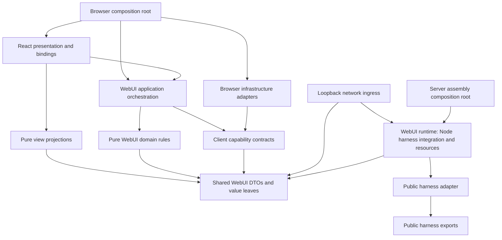

# WebUI responsibility separation and application architecture plan

Status: design proposal; implementation is not authorized by this document.
Shape and constraints: [ADR 0014](../adr/0014-webui-splits-its-internal-capability-and-orchestration-layers.md).
Terminology: [CONTEXT.md](../../CONTEXT.md), section "WebUI internal layers".
Source baseline: branch `webui`, commit `89907fb3734c6ad998a34b4bb72137a970eb19fe`, inspected on 2026-10-09.
This plan changes no source, tests, configuration, generated inventory, Git branch, or runtime state. Its companion records — ADR 0014, the `CONTEXT.md` terminology section and the ADR 0004 consequence note — are documentation only.

## 1. Decision and evidence discipline

**Recommendation: one definite target architecture, reached by staged migration.** The execution chain is **React → browser application → browser transport → loopback server → WebUI runtime integration → public harness**, where browser→loopback is a cross-process protocol and loopback→harness stays an in-process call (`packages/webui/src/server/port.ts:9`, `docs/adr/0001-webui-is-a-peer-client-of-the-harness.md:3`). Four re-drawn boundaries follow:

- **`src/runtime/`** owns harness capability adaptation and every Node-side process resource — OAuth core, leases, refresh timers, quota, check-in, account login, mcode-tools broker, browser provider, profile files, session transfer, and the harness adapters split out of the 905-line `createHarnessPortFromHost`.
- **`src/client/application/`** owns browser business orchestration, the single writer authority for session and interaction records, recovery policy and request ownership.
- **`src/shared/`** is the only declaration point for cross-process protocol contracts; it has no state, no effects and no total barrel.
- **`src/server/`** keeps network ingress, authentication, dispatch, wire projection and socket lifecycle — and nothing else.

This is adopted because host capability adaptation and process resource ownership are duties genuinely different from network ingress, not because of any line count or any TUI parity. TUI shows that such a split is workable; parity itself is explicitly **not** an acceptance criterion [E15].

This direction is not a new invention. `packages/tui/src/` already separates `runtime/` (37 files: `port.ts`, `auth-session.ts`, `embedded-host.ts`, `lifecycle.ts` at 928 lines, `mcode-tools-integration.ts` at 243 lines, `event-normalizer.ts`, `stream-events.ts`), `application/` (18 files, led by `run-coordinator.ts` at 640 lines), `types/` (4 files, 595 lines) and the terminal UI (270 files). `TuiRunCoordinator` holds `activeRun`/`retiringRun` state and recovery policy and receives its runtime through constructor injection at `packages/tui/src/application/run-coordinator.ts:99-107`; `application/` imports `runtime/` in one direction only, the single reverse reference being a type import at `packages/tui/src/runtime/port.ts:17`. The TUI UI is not a pure-view precedent: `packages/tui/src/tui/controller/session-flow.ts:32` injects runtime session capabilities and performs draft switching and observer detach. TUI therefore supplies a real precedent for the responsibility split, not proof that a directory name alone fixes anything [E14].

The real problem remains that React components own asynchronous business workflows, competing reads, recovery policy, and state commits. The client/server split describes execution location but does not assign these responsibilities. Existing pure reducers and the session store are the starting point to move, not architecture to discard [E1–E4].

All source references below are repository-relative `file:line` anchors at the baseline above. **Fact** means directly inspected source. **Hypothesis** means an outcome or defect not established by this inspection. **Recommendation** means proposed behavior or ownership, grounded in the cited facts; it is not already implemented. Quantitative observations supplied in the task are sizing inputs, not independently reproduced measurements here. Handler classification was re-derived with the repository's own TypeScript parser. The reproducible facts are: **99 handler entries**; **91** call exactly one `WebuiHarnessPort` method and do nothing else (78 straight, 13 after asserting the optional port exists); **8** invoke a local resource (`terminal!`, `listWorkspaceDirectories`, `runWebuiCommand`); and of the 91, only a handful add any projection or stream shaping — `getMessages`, `sendMessage`, `resumeSession`, `watchEvents`, `signOut`. Treating the 91 as "forwarding" versus splitting it into 78/13 is a formatting judgement, not a substantive difference, so only the 99 total and the 91/8 split are treated as established. The test surface matching `client/projection/*` or `client/stream.*` imports is **37** files, not ~80. None of these are acceptance criteria.

> 🧠 **From Hindsight memory (Component map)** — Earlier records describe WebUI as a leaf browser/loopback client with a harness port and separate TypeScript programs. Those constraints were checked against `packages/webui/AGENTS.md:7`, `packages/webui/AGENTS.md:13`, `packages/webui/tsconfig.client.json:13`, and `packages/webui/tsconfig.server.json:9`. Earlier layout descriptions are historical and do not establish current module purity.

> 🧠 **From Hindsight memory (Key decisions and rationale)** — Earlier records retain the prohibition on importing TUI implementations and the preference for directional client dependencies. The current package guide confirms these requirements at `packages/webui/AGENTS.md:108`. This proposal makes the direction more precise; it does not assume that the existing source already satisfies it.

### Evidence register

| ID | Confirmed source and implication |
| --- | --- |
| E1 | `packages/webui/src/client/components/WebuiClientFoundationApp.tsx:250` and `:254` own flat/tree pages; `:395` reads history progress; `:411` and `:440` independently load list/tree; `:490` selects live todos over history under a `hasTodoSnapshot` flag while `:494-501` merges subagents in history → tree → live precedence; `:517` refreshes both; `:536` mutates session titles; `:677` handles retry; `:756` migrates home runtime and composer state; `:794` starts a new task. Both precedence rules are implicit in statement order and expansion direction, with no comment and no test pinning them. Business orchestration is in the shell. |
| E2 | `packages/webui/src/client/components/WebuiClientFoundationApp.tsx:963` subscribes to global activity and supplies a reconnect callback at `:972-975`; `:1042` probes active turns. `packages/webui/src/client/components/SessionComposer.tsx:921` also probes missed turns, `:932` creates the session event callback, and `:976` separately subscribes and refreshes after reconnect. There are **four** watcher call sites: additionally `packages/webui/src/client/components/WorkspacePanels.tsx:286` and `:544`. **Correction after re-inspection:** those two panel sites do *not* coordinate recovery — both filter on `workspace.git.changed` and take no reconnect callback (`:286-292`, `:544-548`); the shell and composer sites do. So four independent sockets exist, but only two recovery owners. The named consumers also write **disjoint state slices** (activity/unread vs stream/permission/goal), so this is one event bus with four subscribers, not redundant writes to one store. |
| E3 | `packages/webui/src/client/session-runtime-store.ts:19` imports React; `:71` updates the canonical map; `:86` creates turn writers; `:131` permits one home-writer migration; `:156` moves stored state without notifying listeners; `:166` provides a React hook. `packages/webui/src/client/projection/effect-reducer.ts:154` reduces events; `:89` defines commands; `:504` executes them; `:545` bridges the reducer to callbacks. The store mixes framework integration with ownership, while reduction and effects already have a seam. Independently verified: the React surface is exactly `useEffect`/`useState` used only by `useSessionRuntimeState` (`:166-209`); the map, listener registry and writer creation at `:54-164` are framework-free, so decoupling means moving one hook and repointing four call sites (`ConnectionStatus.tsx:2`, `SessionTranscript.tsx:17`, `WebuiClientFoundationApp.tsx:131`, `SessionComposer.tsx:148`). |
| E4 | `packages/webui/src/client/stream.ts:29` explicitly distinguishes lease ownership from turn phase; `:77` holds stream state, `:87` retains latest generation after lease release, `:165` decides attach/claim/hold/recheck, `:199` releases scoped leases, `:223` settles abort, and `:245` fences cleanup. `packages/webui/src/client/projection/composer-state.ts:89` derives liveness from phase; `:382` submits asynchronously. These fields cannot safely be collapsed into one busy boolean. |
| E5 | `packages/webui/src/client/connection-health.ts:32` owns watcher health globally; `:36` derives degraded; `:87` exposes a React hook. `packages/webui/src/client/transport.ts:244` opens watchers; `:262` registers watcher health; `:302` marks acceptance; `:318` marks loss; `:349` unregisters. `packages/webui/src/client/main.tsx:60` constructs one transport. One transport object currently does not mean one event subscription. **This module is deliberate gap-closing, not duplicated state:** its own header comment (`:1-20`) states that the stream phase stays `idle` while the page shows nothing during a silent drop, so it aggregates "was healthy then went down" separately from the per-session phase. It must not be collapsed into the stream store as duplicate state. |
| E6 | `packages/webui/src/server/assembly.ts:296` schedules auth refresh; `:356` constructs the auth lease session; `:367` declares `runtimeOwnerKind: "webui"`; `:452` watches auth changes; `:467` wraps shutdown with auth timer, runtime, broker and browser cleanup; `:511` supplies check-in credentials; `:536` constructs account login and `:541` exposes quota. These are process-owned resource responsibilities, not browser state. |
| E7 | `packages/webui/src/server/port.ts:9` identifies the harness seam; `:17` deliberately owns stable WebUI wire shapes. `packages/webui/src/server/operation/operation-handlers.ts:124` derives the handler map type; `:130` constructs handlers. Re-derived with the repository's TypeScript parser: the map registers **99** entries; **91** only delegate to a single `WebuiHarnessPort` method (78 straight, 13 after asserting the optional port exists), **8** invoke a local resource instead (`terminal!`, `listWorkspaceDirectories`, `runWebuiCommand`), and within the 91 only `getMessages`, `sendMessage`, `resumeSession`, `watchEvents` and `signOut` add projection, fallback or stream shaping. `packages/webui/src/server/host.ts:1` describes the harness adapter. Thin forwarding at an actual protocol seam can be legitimate; cloning it into another facade adds no ownership. |
| E8 | `scripts/lib/webui-boundary.mjs:60`, `:70`, `:79`, `:91`, `:117`, `:133` implement six build-input/public-source rules, listed at `:145`. The same-package exemption at `:138` does not enforce internal dependency direction. Type-only imports disappear from build output. |
| E9 | `CONTEXT.md:70` defines runtime owner as a running harness instance; `:76` defines surface as declared interface identity. The task's identity wording is not the current glossary. `packages/webui/src/server/assembly.ts:367` already declares `webui`; earlier memory describing `tui` is stale for this checkout. No identity/policy change belongs in this plan. |
| E10 | `packages/webui/src/client/components/WebuiClientFoundationApp.tsx:930` owns activity/unread; `:983` documents hydration-before-persist; `:1027` seeds activity; `:1033` restores stored counts. `packages/webui/src/client/session-unread.ts:54` persists counts and treats storage failures as loss of persistence, not loss of in-memory state. |
| E11 | `packages/webui/src/client/projection/composer-state.ts:346` and `:382` execute async workflows; `packages/webui/src/client/projection/model-favorites.ts:22` imports component types and `:68`/`:83` access storage; `packages/webui/src/client/projection/file-line-navigation.ts:7` invokes focus/scroll. `packages/webui/src/client/projection/effect-reducer.ts:66` imports stream operations while `packages/webui/src/client/stream.ts:2` imports workspace progress. The projection directory is neither uniformly pure nor an already clean dependency tier. |
| E12 | `packages/webui/AGENTS.md:13` documents the leaf/sync exception; `scripts/source-inventory.mjs:119` distinguishes regeneration from checking and `:134` rejects missing/added paths. `scripts/ci-changes.mjs:15` classifies documentation; `scripts/verify.mjs:41` includes source inventory even for docs and `:57`–`:65` declares WebUI gates. |
| E13 | **Out of scope but must not be claimed as a side effect.** Two harness-facing gaps recorded as unfixed in `packages/webui/docs/capability-gaps.md` are independent of client layering: the connector/broker reachability break sits at `scripts/run-webui-server.mjs:14-22,40-43` (the launcher forwards the environment without constructing the broker's required host variables, and discovery reachability is a second, separate question per that document's lines 68-82); and WebUI still declares `promptProfile: 'tui'` with `promptSurfaceDefault: 'cli'` at `packages/local-runtime/src/runtime/runtime-owner-policy.ts:378-380`, which is a harness client-policy decision, not a directory boundary. Moving WebUI code neither fixes, refutes, nor validates either one. |
| E14 | **The TUI peer client already splits these responsibilities.** `packages/tui/src/runtime/` (37 files) holds `port.ts` (capability contract, importing harness request types at `:22`), `auth-session.ts`, `browser-provider.ts`, `embedded-host.ts`, `lifecycle.ts` (928 lines), `mcode-tools-integration.ts` (243), `event-normalizer.ts`, `stream-events.ts`. `packages/tui/src/application/` (18 files) holds `run-coordinator.ts` (640 lines) with `activeRun`/`retiringRun` at `:100-101`, recovery in `sendWithQueueRecovery`/`stopAndSettle`, and constructor-injected runtime at `:104-107`; also `pending-questionnaire.ts`, `login-gate.ts`, `permission-mode.ts`. `packages/tui/src/types/` (4 files, 595 lines) holds shared contract types. Dependency direction is `application/` → `runtime/`, with one reverse reference, a type-only import at `packages/tui/src/runtime/port.ts:17`. **The TUI UI is not pure view:** `packages/tui/src/tui/controller/session-flow.ts:32` injects runtime session capabilities. **TUI's verification does not constrain direction:** `scripts/check-standalone-boundary.mjs:11-28` positively asserts that named runtime/application files appear in the esbuild metafile with `bytesInOutput > 0`; it cannot detect a forbidden reverse edge, and it cannot see `import type` edges because those are erased from build output. |
| E15 | **Process-boundary correction.** `packages/webui/src/server/port.ts:9-13` states the service reaches the harness through the **in-process** runtime host and its `CliService` facade; only browser→loopback is a real process/protocol boundary. A design must not model both as the same kind of remote service. **Shell hook count correction:** an AST scan of `packages/webui/src/client/components/WebuiClientFoundationApp.tsx` finds **33** `useState` calls and 0 `useReducer`; line counts and hook counts are symptoms to investigate, not architecture defects or acceptance criteria on their own. `server/service.ts:122-141` declares **20** private fields (not 15), and field count is not a concern count either — the split follows actual behaviour and resource ownership. **Reverse-dependency claim withdrawn:** an import/export scan of `packages/webui/src` found the shell referenced only by `client/main.tsx`; the earlier "seven modules depend on the shell" figure did not reproduce. The rule forbidding feature modules from importing the shell still stands. **Symmetry is not an acceptance criterion:** directory symmetry, file granularity and port shape parity with TUI are explicitly excluded from what counts as success here. | `packages/webui/src/server/port.ts:9-13` states the service reaches the harness through the **in-process** runtime host and its `CliService` facade; only browser→loopback is a real process/protocol boundary. A design must not model both as the same kind of remote service. **Shell hook count correction:** an AST scan of `packages/webui/src/client/components/WebuiClientFoundationApp.tsx` finds **33** `useState` calls and 0 `useReducer`; line counts and hook counts are symptoms to investigate, not architecture defects or acceptance criteria on their own. `server/service.ts:122-141` declares **20** private fields (not 15), and field count is not a concern count either — the split follows actual behaviour and resource ownership. **Reverse-dependency claim withdrawn:** an import/export scan of `packages/webui/src` found the shell referenced only by `client/main.tsx`; the earlier "seven modules depend on the shell" figure did not reproduce. The rule forbidding feature modules from importing the shell still stands. **Symmetry is not an acceptance criterion:** directory symmetry, file granularity and port shape parity with TUI are explicitly excluded from what counts as success here. |
| E16 | **Server→client dependencies are erased type dependencies, but remain source coupling.** The TypeScript AST scan finds **37** client→server file pairs / **40** references, all targeting `server/port.ts`, and **3** server→client file pairs / **16** references, all targeting `client/contracts.ts`. The server→client references are `host.ts:88,284,287,288,293,300,304`; `port.ts:1122,1127,1136,1139,1147,1152,1159,1163`; and `profile-files.ts:49`. The import declarations at `host.ts:88` and `profile-files.ts:49` are `import type`; the remaining references are type queries. They emit no runtime import, but they pull browser contract declarations into the Node source dependency graph. **Correction to an earlier reading:** `host.ts:91` was initially misread as a value import. `ImportDeclaration.isTypeOnly` alone is not a sufficient test for type dependency, because type queries do not appear as import declarations. All three file pairs must disappear by assigning wire DTOs to shared contracts and browser-only view types to `client/contracts`; making an edge type-only is not sufficient. This source-dependency correction does not change capability availability or the timing and messages of operation failures — the two are consistent but not causally linked [E7]. |

### Can existing responsibilities solve the two highlighted problems?

**Yes. Duplicate state management can be corrected without adding a server layer.** Extend the existing store into the sole owner of client session records and asynchronous commit policy; make list/tree/history/live inputs feed that owner and make components read selectors. Keep legitimate query metadata and distinct facts rather than pretending every pair of fields is a duplicate. Extract framework hooks from that store. This is a change in write authority and workflow placement, whether or not files move [E1, E3–E5, E10].

**Yes. Two reducers are not intrinsically wrong.** Activity is global across sessions; the effect reducer concerns session progress, permissions, questionnaire, goal and stream attachment. Preserve both as domain reducers. Introduce one application-owned process-event subscription, route an event to the relevant reducers, commit coherent client slices, then execute returned effects. The shell and composer subscribe to snapshots, not process events. Deduplicate active-turn probes and attach decisions per session. The same event may legitimately inform two derived views; it must not independently claim two streams or update the same authoritative field twice [E2–E4].

**Hypotheses to validate during implementation:** this consolidation will reduce recovery races and feature edit points; it may also reduce connections. This inspection does not prove current user-visible corruption, lower latency, less memory, or cross-tab consistency. Current reducers, comments and code identify risks and invariants, not a reproduced failure [E2, E4, E5].

**Two known harness-facing gaps are explicitly outside this scope.** Connector/broker unreachability and WebUI's inherited `promptProfile: 'tui'` are recorded separately in `packages/webui/docs/capability-gaps.md`. They are capability and policy decisions owned by harness and launcher code. If any later phase claims to unify harness capability access, it must demonstrate end-to-end environment injection, tool discovery and permission boundaries; passing type checks or bundle boundaries is not evidence, and authorizing local connected Apps carries a real access-scope decision that must be made explicitly rather than inherited from a layer reorganisation [E13].

## 2. What is core, and what is WebUI business logic?

There are two meanings of core that must stay separate. **Product execution core** is the harness: durable sessions, turn execution/queueing, agent/tool behavior, permissions and persisted history. WebUI consumes it through the exported host and its WebUI-owned adapter; it does not copy execution policy into a browser store [E6, E7; `packages/webui/AGENTS.md:7`]. **WebUI foundational mechanisms** are framing, transport/reconnection, subscription fencing, snapshot notification and defensive value decoding. They are lower-level browser mechanisms, not new harness capabilities [E3–E5].

**WebUI business logic** is how this interface interprets events and coordinates its tasks: create/select/fork/archive/import/export/delete, home-to-session adoption, interaction refresh, unread/read intent, history/live progress precedence, and renderable transcript grouping. A pure function can still be WebUI business logic. Purity means no effect execution; it does not establish cross-client reuse [E1–E4, E10, E11].

### Required module classification

Every current projection file is classified below. Recommendations separate mixed behavior by responsibility; they do not prescribe bulk relocation. References point to representative executable functions, not to header claims of purity.

| Current `client/projection/` file and anchor | Classification and proposed owner |
| --- | --- |
| `action-requests.ts:21` | Pure WebUI request rules; retain domain functions. |
| `composer-history.ts:69` | Pure WebUI draft/history transitions; application owns per-session persisted state, UI owns temporary navigation intent. |
| `composer-interactions.ts:13` | Pure presentation/input rules; presentation owns them. |
| `composer-state.ts:145`, `:346`, `:382` | Mixed submission decisions and async execution; retain pure intent/request rules, migrate goal/send/queue workflow execution to application. |
| `context-breakdown.ts:91` | Pure presentation formatting/geometry; presentation. |
| `context-usage-popover.ts:84` | Pure popover placement; presentation. |
| `context-usage.ts:11` | Pure context snapshot selection; domain selector, consumable by application/presentation. |
| `effect-reducer.ts:154`, `:504`, `:545` | Mixed domain reducer and executor/callback bridge; reducer stays pure, application owns executor and event routing. |
| `event-parsers.ts:26` | Pure WebUI event interpretation; domain functions over shared wire DTOs. |
| `file-line-navigation.ts:7`, `:12` | Mixed imperative focus/scroll and pure IDs; browser/presentation adapter owns effects, pure helper remains. |
| `flyout-position.ts:66` | Pure UI geometry; presentation. |
| `goal-state.ts:19` | Pure WebUI goal projection/edit rules; domain. |
| `message-file-reference.ts:8` | Pure WebUI file-link interpretation; presentation/domain read projection. |
| `message-parts.ts:287` | Pure WebUI renderable message projection; presentation, not harness serialization. |
| `message-projection.ts:36`, `:118` | Pure message view interpretation; presentation. |
| `model-favorites.ts:57`, `:68`, `:83` | Mixed preference rules and storage effects; pure preference functions plus injected persistence adapter. Remove dependency on component-owned model types. |
| `model-picker-cascade.ts:45` | Pure picker interaction rules; presentation. |
| `model-picker-hover.ts:80` | Pure pointer/hover decisions; presentation. |
| `model-picker-search.ts:52` | Pure picker search; presentation. |
| `model-reorder.ts:2` | Pure preference ordering; domain/presentation leaf. |
| `outside-close.ts:175` | Pure dismissal decisions; presentation; DOM listeners remain in UI adapter. |
| `plan-mode.ts:53`, `:237` | Pure WebUI plan interpretation/answer construction; domain rules. |
| `questionnaire-state.ts:22`, `:94` | Pure answer/step rules; domain; questionnaire execution state owned by application, unsent answer edits by UI. |
| `review-state.ts:112` | Pure review UI transitions; presentation; server remains authoritative for files/diffs. |
| `shell-surface.ts:35` | Pure navigation/surface transitions; presentation. |
| `thinking-control.ts:38` | Pure model-control interpretation; domain/presentation rules. |
| `token-plan-model.ts:52` | Pure WebUI model classification; domain rules. |
| `tool-projection.ts:13` | Pure tool display interpretation; presentation. |
| `transcript-projection.ts:43` | Pure transcript grouping/view composition; presentation; no workflow or connection ownership. |
| `transcript-request-ownership.ts:26` | Stateful request-coordination mechanism; application uses it for owned async reads; not a pure projection. |
| `transcript-scroll.ts:17` | Pure scroll calculations; presentation; DOM measurement stays outside. |
| `transcript-shape.ts:258`, `:362` | Pure historical/live render shapes; presentation. |
| `usage-settings.ts:14` | Pure settings view formatting; presentation. |
| `workspace-panel-state.ts:33` | Pure panel/tab transitions; presentation state, not workspace execution state. |
| `workspace-progress.ts:242`, `:394` | Pure WebUI progress interpretation; domain; application owns history/tree/live input versions and consolidated selector. |
| `worktree-state.ts:48`, `:66` | Pure WebUI workspace grouping; domain/presentation selector. |

All table paths are prefixed by `packages/webui/src/client/projection/`. Moving every pure function into one generic core would obscure these distinctions and enlarge scope [E11].

| Other required module | Classification and separation |
| --- | --- |
| `packages/webui/src/client/stream.ts:29`, `:77`, `:165` | Mixed foundational lease/frame mechanics and WebUI stream/progress projections. Preserve lease/fencing logic as framework-free mechanisms; extract types and lease operations so domain reduction does not depend on a stream module that imports domain progress. Application owns when to send/resume/probe; transport owns sockets. |
| `packages/webui/src/client/transport.ts:104`, `:244` | Infrastructure adapter implementing WebUI wire operations. Own framing, socket/reconnect and reported connection facts; do not select sessions, count unread, combine progress or decide business mutations. Inject it into application once [E5]. |
| `packages/webui/src/client/session-runtime-store.ts:71`, `:166` | Mixed snapshot/notification mechanism, WebUI session state and React binding. Keep one canonical state owner; expose framework-free read/subscribe/internal commit; put React subscription hook outside. Do not retain a legacy writable map alongside a new store [E3]. |

## 3. Proposed responsibilities and interfaces

### Ownership by execution location

| Owner | Included responsibility | Explicit boundary |
| --- | --- | --- |
| WebUI runtime (Node) | Harness capability contract; adaptation of the public host into WebUI consumption shapes; OAuth core, active lease, refresh timer, auth invalidation propagation; account/quota/check-in composition; mcode-tools broker preparation and disposal; resource acquisition failure cleanup, idempotent close and close ordering. | Node-only. No browser, React, DOM or storage-bundle knowledge. Exactly one OAuth core, one refresh owner and one overall close owner; splitting modules must not wrap `host.close()` more than once. Never claims to cancel harness work [E6, E14]. |
| Browser application | Session query normalization; mutation completion/invalidation; send/queue/stop/retry orchestration; lease claim and generation fencing; home adoption; process-event routing and reconnect probing; session interaction/goal refresh; progress reconciliation; unread hydration/persistence ordering. | No React, DOM, direct storage, WebSocket construction, filesystem or harness imports. Cannot import the Node `src/runtime/` port: browser capability access goes through the injected transport [E1–E5, E10, E14]. |
| Browser presentation | Render/selectors; focus/scroll; draft editing, IME, flyouts, menu/collapse state; user prompts/download/file pickers; pathname/hash adapter. | Business actions pass explicit IDs/input to application. No recovery workflow, direct authoritative session setters or process-event watchers [E1, E2, E11]. |
| Browser infrastructure | Transport, sockets/reconnect, storage adapter, clock and subscription notification mechanisms. | Reports facts/results; application decides consequences. No component imports [E3, E5, E11]. |
| Loopback server | Envelope validation, request authentication, dispatch, stable wire projection, terminal/files/archive adapters, HTTP/assets. | Network ingress only: no browser store, no React, and no client orchestration; it does not know which session a browser has selected [E7; `packages/webui/AGENTS.md:84`]. |
| Server assembly | Composition root: construct runtime resources, inject them into the server, own startup/shutdown sequencing. | No longer inlines OAuth state machines, timers or resource internals [E6, E14]. |
| Harness | Durable sessions/history, active-turn truth, execution, queue scheduling, interaction validity, tool/model policies. | Consumed through current public host/port. No owner-policy or scheduler migration in this refactor [E4, E6, E7, E9]. |

Naming: **`src/runtime/`** is the WebUI runtime integration layer (Node side); **`src/client/application/`** is the client business-orchestration layer. `runtime owner` keeps its current glossary meaning of a running harness instance (`CONTEXT.md:70`), which does not collide — TUI already uses the same two names. Do not add a separate `client/runtime/` for business state: that would create two objects both called "WebUI runtime". Keep `WebuiHarnessPort` (Node callable capabilities) and the browser capability interface as distinct types rather than one large interface spanning the process boundary [E9, E14].

### Data ownership and lifecycle

The application instance is scoped to one browser root plus transport/auth context, created at composition time and explicitly disposed. React remounts and session selection do not recreate its global watcher. Session switching changes view selection and may activate detail queries; it does not transfer stream writer ownership. Background activity remains observable. Whether to retain off-screen transcript streams follows current behavior first, with any expanded background streaming requiring a separate cost decision [E2–E5].

| Data | Sole client owner / lifespan / update contract |
| --- | --- |
| Session records | Application entity map keyed by session ID, until deletion or instance disposal. Flat/tree queries retain separate ID lists, parent relationships, cursors, filters and loading/error metadata. These are distinct queries; normalization does not justify dropping either endpoint. A mutation updates/invalidate both views without maintaining two mutable entity copies [E1]. |
| Active turn / submission / lease | Per-session record with distinct `activeTurn`, submission status, stream phase, subscription generation and latest-claim generation. Harness owns active-turn truth. Application centralizes writers and derived `canSubmit`/`canQueue`/busy selectors; no component infers authority from one boolean [E4]. |
| Transcript/history | Preserve current message identity, pagination and live data contract. Application owns request token/session/cursor guards; rendering projects records. Do not invent atomic history/watermark semantics absent from the wire. A complete canonical transcript redesign is outside this plan [E3, E4; `projection/transcript-request-ownership.ts:26`]. |
| Progress | Per-session history baseline, tree metadata and live overlay, with provenance/version guards. One selector preserves current precedence: live todo snapshot overrides history; subagents merge history then tree then live. An empty live snapshot must still override history. Retain inputs where needed; remove independently writable merged copies and shell merge code [E1]. |
| Permissions/questionnaire/goal | Session-keyed application records; authoritative refresh after watch acceptance/reconnect and interaction outcomes. Each read records session and request version; an event-applied newer goal must defeat a late refresh. UI holds unsent questionnaire answers separately [E2, E3]. |
| Activity/unread | Application activity records; persisted unread is a snapshot, not a second live writer. Hydrate once before accepting counted events/persisting, then seed list data without overwriting event-derived busy/unread. Selection is an explicit mark-read intent. Preserve current best-effort storage behavior [E10]. |
| Connection state | Infrastructure reports per-channel connected/ever-connected/reconnecting facts; application exposes derived event-channel health independently of per-session turn/stream phase. No forced equivalence between event disconnection and turn completion [E4, E5]. |
| Drafts and view preferences | Existing composer persistence may remain its own owner, coordinated by application during home adoption; no duplicate draft store. UI owns transient textarea, focus, flyout and tab state. Persistent preferences use adapters; they do not require the session application to become a universal settings store [E1, E11]. |

Disposal stops the global watcher, reconnect callbacks, scheduled probes and client listeners; every outstanding completion checks instance/session/request ownership. Stop/delete invalidates its session writer generation before releasing client state. Successful deletion purges that session's cached queries, interactions, unread and persisted drafts; failed deletion keeps them and reports failure. Home adoption commits runtime/composer association and selection consistently before snapshot publication; unlike the current move helper, it must notify already mounted readers safely. Instance disposal does not claim to cancel harness work [E3, E4, E6, E10].

### Interface proposal

These are conceptual interfaces for review, not final TypeScript signatures or a list of new forwarding methods [E1–E4, E7]:

| Seam | Interface and invariants |
| --- | --- |
| Application → UI | Stable immutable `getSnapshot()` and `subscribe(listener)`; selectors for rail, selected session, composer availability, progress and connection status. Publish after a coherent commit, not after each reducer setter. UI cannot receive `setStream` or an unrestricted state update function. |
| UI → application | Explicit domain intents: select/new-task, submit, stop/retry, session mutation, interaction answer, goal edit, mark-read and load-more. Discriminated payloads capture session IDs and operation-specific fields. Commands return completion or typed error/capability absence; navigation/download effects return explicit results to the UI adapter. Avoid a catch-all untyped action bus. |
| Application → mechanisms | Inject current transport, storage, clock and owned-request helpers. Internally use focused `Pick` contracts for session queries, stream control and interactions; do not duplicate every transport method in a new facade. Storage adapter exposes persisted preference/unread operations and failure outcomes, without leaking credentials. |
| Infrastructure → application | Event delivery plus channel ready/lost notifications. Current watch acknowledgement is not a subscription barrier, so ready/reconnect also initiates authoritative probes [E2]. Stream frames retain per-session lease generation, accepted cursor and terminal fencing [E4]. |
| Server → harness | Retain `WebuiHarnessPort` and current host adaptation; exported harness contracts remain behind the adapter, and those callable types become `src/runtime/port.ts` rather than moving into `shared/`. WebUI wire DTOs are WebUI-owned and migrate to `src/shared/` **only per DTO**, when the consuming slice can name the browser/server contract need it unblocks. Do not relocate `port.ts` wholesale: `AsyncIterable` capabilities, process handles and harness service types are not browser DTOs [E7]. |

Command execution first commits synchronous domain updates, then invokes effects using captured ownership tokens. Async outcomes are reintroduced as owned results. Use the existing reducer/executor ordering as the migration baseline; do not silently reorder progress, permission or terminal behavior. The claim must be committed before opening a recovered stream, and stale `finally`, probes, terminal events and frames must not settle a newer lease [E3, E4].

The application consumes harness capabilities **indirectly**: application → injected transport → authenticated loopback dispatch → WebUI port/host adapter → public harness. OAuth leases, browser tool resources and broker shutdown remain entirely server-owned. Missing optional client capabilities are explicit unavailable outcomes, preserving current UI gating rather than reporting successful empty work [E6, E7; `packages/webui/AGENTS.md:47`].

### Dependency direction and machine enforcement



Import arrows describe source dependency, not event travel. Root injects infrastructure into application; application does not import its concrete transport implementation. **The browser graph never reaches `src/runtime/`: the browser application reaches harness capabilities only through the injected transport, and `runtime/` depends on shared contracts without anything depending back on it.** Server assembly composes runtime resources and injects them into the network layer; it does not re-implement them. Shared contracts contain neither browser nor Node effects. Presentation-specific DTOs must live below their consumers rather than in `ModelPicker` or another component. Domain and view are separate concerns; neither imports application or concrete infrastructure [E7, E11, E14].

**Recommendation:** an AST-based internal dependency check is the primary mechanism; the existing esbuild metafile checks remain for bundle composition only. This split is deliberate. TUI's `scripts/check-standalone-boundary.mjs:11-28` positively asserts that named files appear in the build output, which proves *presence*, not *direction*: an application module importing a component would still pass it. It also cannot see `import type` edges, because those are erased from build output. So metafile assertions may confirm that a capability module reaches a build, but must not be described as a layering check [E8, E11, E14].

Implement the direction check by parsing the source import graph with the repository's existing TypeScript dependency: resolve static imports, re-exports, `import type`, type queries and literal dynamic imports through the real tsconfig resolver; reject unresolved internal imports and nonliteral internal dynamic imports rather than allowing an unchecked escape; traverse barrels so a type re-export cannot hide a component dependency; and detect cycles [E8, E11, E14].

The rule matrix must deny: domain/view → React, components, application, concrete transport, server or Node; application → components/React/DOM/concrete transport/server, and **application → the Node `src/runtime/` port**; browser infrastructure → components/application implementation; **Node runtime → browser, React, DOM or storage-bundle knowledge**; shared contracts → either execution side. Only composition roots may join application, UI and concrete adapters. React bindings may import application interface types and hooks; no back-import. Contract declarations are leaves and cannot import projection implementation. Check an allowed-edge matrix rather than a directory-name denylist. Resolve `stream`/progress types before enforcing this, avoiding a new cycle through `contracts.ts` [E3, E8, E11, E14].

Two hard prerequisites: `src/runtime/` must be added to the `include` of `tsconfig.server.json`, which currently covers only `src/server/**` and `src/shared/**`, or it escapes type checking entirely and a passing architecture check would not substitute for type checking; and the architecture gate must register in `scripts/verify.mjs` alongside the existing WebUI checks, ordered so source-level direction failures surface before build and metafile checks [E8, E12, E14].

Introduce the check with an explicit, fixed baseline of existing exceptions, each assigned to a migration stage and an owner; no new violations permitted. Remove the relevant exceptions with each slice, reaching zero for the refactored feature paths. Negative fixtures must cover application → components, application → React/DOM, runtime → browser-only, shared → client/server, domain → concrete transport, a forbidden edge hidden behind an `export type` barrel, literal dynamic imports, cycles, and specifically an `import type` violation proving the check sees what metafile cannot. Register tests in the declared suite registry; do not alter CI workflows independently. This is future implementation work, not a check performed this turn [E8, E12, E14].

## 4. Migration and avoidance of overlapping owners

| Existing behavior | Required migration and final owner | What disappears |
| --- | --- | --- |
| Shell rail fetch/refresh and session mutation callbacks | Session application owns reads, normalized record commits, query invalidation and mutation completion. UI prompts/file selection/download remain presentation adapters [E1]. | Shell's mutable page/tree entity copies and per-handler refresh choreography. |
| Shell activity watcher and composer event watcher/probes | One global event ingress and session recovery coordinator; retain separate reducers privately. Route normalized events once to affected slices [E2, E3]. | Component watchers/probes for those domains and duplicate active-turn requests. |
| Additional panels consuming `watchEvents` | Inventory all callers before cutover; panels receive selectors or scoped application invalidations. Terminal streams remain separate channels [E1 at `:1091`, E5]. | Residual independent process-event sockets after the global cutover. |
| Store map/hooks/setter writers | Framework-free canonical owner plus React read binding. Application alone obtains write authority and generation-scoped writers [E3]. | Writable component hooks and a second compatibility store. |
| Composer submission, goal submission and recovery/retry/stop | Reuse pure intent rules and stream loop, move async sequencing and result commits to application [E2–E4, E11]. | Component-owned business closures and `projection/` effect execution for migrated workflows. |
| Progress merging | Application owns guarded source inputs; one domain selector supplies panel state [E1]. | Shell merge and separate writable merged output. |
| Unread hydration, marking, pruning and persistence | One application initialization/commit/persistence workflow using existing storage adapter semantics [E10]. | Six independently synchronized component effects and repeated restore over live counts. |
| Server forwarding handlers | Keep the actual wire adaptation seam. Optionally simplify boilerplate later only if error/projection semantics are preserved [E7]. | No obligatory handler rewrite; no new 99-method application facade. |
| Auth/quota/broker/browser resources | Keep current assembly lifetime; server resource decomposition is a separately justified change [E6]. | Nothing moves into browser application. |

The switch for each slice replaces the old writer in the same change. A read-only compatibility selector may bridge callers temporarily; it cannot own a map, write state, or re-export a moved file through a permanent shim. Shadow comparison is permissible only with a pure offline comparison reducer; never execute both sets of attach/send/persist effects [E3, E4; `packages/webui/AGENTS.md:118`].

A module earns its place when it owns **one workflow that currently crosses multiple owners and carries duplicated recovery or commit responsibility, and whose extraction deletes those responsibilities from the old callers**. The judgment unit is the workflow and the responsibility it deletes — *not* the number of direct callers. Multiple callers are supporting evidence, not a requirement: a single-caller workflow that currently forces one component to own querying, recovery and commit still qualifies. The acceptance test is a written before/after inventory of write paths and effect execution sites for that workflow, showing specific old owners gone. A one-line `application.archiveSession → transport.archiveSession` wrapper fails this test, because deleting it puts no duplicated responsibility anywhere. A mutation workflow that reconciles normalized records, invalidates both query views, guards stale responses, updates selection/unread after success and exposes failure qualifies. Simple capabilities can remain adapter operations until they participate in such a workflow; do not route every workspace/settings method through the session application to force uniformity [E1, E7].

## 5. Cohesion, extension and abstraction cost

### Current business scenarios as proofs

| Scenario | Required coordinated behavior / proof |
| --- | --- |
| First home submission creates a session | Same in-flight writer/message/draft follows the returned session ID, home is cleared, selection and rail update coherently, no replay in the next task. Drive the application interface through creation and mid-stream adoption, then verify rendered UI [E1 at `:756`, E3]. |
| Session A runs while user selects B | A's writer continues to address A; B's transcript/goal/questionnaire/progress never receive A's late data. Terminal event updates A's rail/unread consistently. Switch does not recreate the global event listener [E2–E4, E10]. |
| `/goal`, queued drain or another client starts a turn | Global event ingress/probe invokes attach/claim/hold/recheck once per session; local send and recovered stream cannot both append the same answer. Old frames and cleanup after lease replacement are rejected [E2, E4]. |
| Disconnect, reconnect and overflow | Ready is not assumed to guarantee subscription; probe active turn and refresh interactions, preserve cursor semantics, reload history when required, and distinguish event-channel health from turn liveness. Error/abort/stop settle only the matching owner [E2, E4, E5]. |
| History plus live progress plus tree children | Preserve precedence including empty todo snapshot and child metadata; late history cannot overwrite newer live state. Panel and transcript readers use the same session-owned inputs [E1]. |
| Rename/archive/fork/import/export/delete | Transport failures are visible; success updates all applicable rail views and selection. Export/file handling stays UI-side; deletion cleanup occurs only after confirmed success [E1, E7]. |
| Reload with unread and failing storage | Restore before persist; incoming completions do not get overwritten by repeated restore; selection marks read; failed persistence keeps current counts. Explicitly test duplicate terminal notification policy [E10]. |

These scenarios establish cohesion because each crosses multiple existing owners today. A test that simply confirms a new directory or method forwards a request is insufficient [E1–E4].

### Extension experiments, not current requirements

1. **Second view of the same session** (for example a compact task monitor): read the same application snapshots/selectors, with no new process watcher, recovery policy or writable map. This is a realistic in-tab extension; sharing across browser tabs is not implied. Replaying browser/process events exactly once across tabs requires a separate distributed contract [E2–E5].
2. **New progress event**: add its interpretation in the progress domain rule and expose it through an existing selector. Shell and composer orchestration should not change. If they must both add event switches, the proposed ownership has failed [E1, E2].
3. **New server resource-backed capability**: keep its resource acquisition/disposal in assembly and wire it through validated port/transport contracts. Only a workflow that uses it changes application. Multiple necessary protocol edit points are legitimate; pretending the client layer eliminates them is not [E6, E7].

For each experiment, compare a written change recipe and actual changed owners/import edges before and after. Do not implement speculative adapters or capability frameworks just to make the experiment pass [E7, E11].

Costs include more explicit DTO placement, owned-request metadata, a snapshot subscription interface, adapter wiring, new dependency checks, test migration and a temporary compatibility period. A large snapshot can increase renders; stable slice selectors and unchanged snapshot identity for no-op events are required. A centralized event route can bottleneck high-volume events; measure connection count, reducer invocations, notification count and render count under the same scenario before claiming improvement. No performance benefit is established here [E3, E5, E8, E11].

The application must remain a small set of cohesive session/query/interaction workflows with private mechanisms. If it accumulates every UI preference, file tab, settings panel and raw operation, it becomes a replacement shell. Cancel a proposed extraction if it adds forwarding without removing old writers, or cannot improve the extension recipes. Ownership correction can ship without that extraction [E1, E7].

## 6. Implementation sequence, risks and acceptance

Implementation requires a later authorization; this document is not that authorization. Use purpose-named feature branches from an explicit reviewed `webui` ref. The phases below are dependency ordered; structural moves follow behavioral ownership changes [E12; `AGENTS.md:29`].

| Phase | Changes and affected paths | Exit condition |
| --- | --- | --- |
| 0 — Freeze contracts and baseline | Inventory all event callers/state writers and existing tests; record representative business trajectories, current endpoint semantics, progress precedence, stream identity/cursor guarantees, connection/probe counts and UI screenshots. Review conflicts with in-flight work before implementation. | Scenario matrix agreed; no new behavior hidden under refactor; uncertainty about event identity/history ordering explicitly recorded [E1–E5]. |
| 1 — Contract and dependency seams | **Per-DTO, case-by-case:** propose moving a browser wire DTO out of `server/port.ts` only when its extraction is a prerequisite for an ownership change in later phases. Not every DTO qualifies, and relocation is never justified on its own. A DTO moves only if the consuming slice names the contract conflict it unblocks; otherwise it stays WebUI-owned where `port.ts:17-19` deliberately placed it. **Use capability domains, not four large buckets:** `port.ts` also covers workspace/review, model/provider/configuration, skills/plugin and terminal/command, so a session/stream/interaction/account split alone is insufficient, and `usage/quota` stays independent of `account` because it expresses a consumption window rather than identity. Every DTO records its wire purpose, producer and consumer; business state, React types, Node types and harness-internal types never enter `shared/`. Use **directories, not a new workspace package** — both `tsconfig.client.json:18` and `tsconfig.server.json:10` already include `src/shared/**`, and nothing indicates these contracts need independent cross-package release. Also in this phase: move component-owned data types below their consumers, split stream type/lease dependencies, introduce the AST rule matrix with its fixed exception baseline, and **add `src/runtime/**/*.ts` to the server tsconfig `include`**. | Every relocated DTO names the conflict it unblocks and its producer/consumer; unmigrated DTOs remain importable from `port.ts` by design; client→server DTO imports remain only for the migrated subset; both TypeScript programs compile **and actually cover `src/runtime/`**; wire schemas unchanged; negative dependency fixtures reject violations [E7, E8, E11, E14]. |
| 2 — Node runtime layer | Extract `src/runtime/`: `port.ts` (Node callable capabilities moved from `server/port.ts`), `harness-adapter.ts` absorbing `host.ts`, `auth-session.ts` (OAuth core, lease, refresh timer, invalidation propagation, from `assembly.ts:257,293,452`), `account-services.ts` (quota/check-in/account-login composition from `assembly.ts:275,508,536`), `mcode-tools.ts` (reuse existing `server/mcode-tools.ts:53`), `lifecycle.ts` (failure cleanup, idempotent close, close ordering from `assembly.ts:429,467`). `assembly.ts` stays as composition root only. Browser provider stays an externally supplied resource that runtime registers and closes (`assembly.ts:197,445`) — it is not created here. | Exactly one OAuth core, one refresh owner and one overall close owner; startup failure and normal shutdown both release every acquired resource without double-wrapping `host.close()`; both typecheck programs pass with `src/runtime/` in scope; no browser or React import reaches `src/runtime/` [E6, E14]. |
| 3 — One framework-free state owner | Refactor existing session store without a parallel map; add read/subscribe and React binding; restrict write APIs; coordinate home adoption and disposal; initially retain current fields and workflow semantics. | A/B session isolation, home adoption, stale writer and cleanup scenarios pass; UI is read-only for migrated slices [E3, E4]. |
| 4 — Event ingress and recovery | Consolidate all process-event callers for migrated features, route existing activity/effect reducers, deduplicate probes and preserve attach/fencing/goal version rules. Move command executor and submission/stop/retry workflow ownership out of components. | One process-event watcher per application instance, no component attach/probe writer, ordered commits, all recovery scenarios pass. No double side effects during cutover [E2–E5]. |
| 5 — Queries, progress and unread | Normalize rail entities while retaining query metadata; migrate session mutation workflows; centralize progress reconciliation and unread persistence; leave UI-only state local. | Rename/fork/archive/import/export/delete and late-read scenarios pass; merged progress and unread have one write authority [E1, E10]. |
| 6 — Extract and close seams | Extract the `client/application/` modules named in section 3, remove every migrated compatibility API, shim and dependency-rule exception, update package guidance and regenerate the source inventory. `assembly.ts` stays a composition root; no Node runtime module returns to `server/`. | No forwarding facade, duplicate store, second writable map or component-level process-event watcher remains; zero dependency-rule exceptions for the migrated paths; the six-step shutdown order holds under failure; required gates and real trajectories pass [E6–E8, E12, E14]. |

Phases 3–5 may use smaller reviewable vertical slices, but each slice must remove its old writer immediately. Phase 4 must account for panels, not merely the two named consumers. DTO extraction and ownership changes are distinct reviews: mechanical relocation alone is not an architecture success [E1, E3, E7].

Phases 1–2 (contracts, Node runtime) and phases 3–6 (browser application) are **independent acceptance tracks**. The Node runtime track delivers harness-integration and resource ownership without touching browser orchestration; the application track delivers client state ownership without depending on runtime extraction. Neither is blocked by the other, and a later phase must not silently undo an earlier one [E14].

### Principal risks and controls

| Risk | Control and acceptance evidence |
| --- | --- |
| Collapsing semantically distinct flags | Preserve lease, turn phase, submission and event-channel facts; assert queue/live/done transitions including `sending` cleanup lag [E4, E5; `projection/composer-state.ts:85`]. |
| A new central owner changes asynchronous ordering | Capture session/turn/generation/request version at action time; compare traces for late frames, probes, history and goal refresh; publish one coherent snapshot [E2–E4]. |
| Counting the same terminal event twice | Audit actual event identity and overlap between watch and stream channels before defining deduplication. Do not use timestamp alone. Where IDs are unavailable, specify supported per-turn transition guards and state their limits; do not claim durable exactly-once semantics [E2, E4, E10]. |
| List/tree normalization loses paging or authority | Keep separate query membership/cursors/filter keys and relationship data; guard request versions. Preserve current precedence first; if contradictory endpoint data lacks comparable revisions, flag it as a contract question rather than inventing latest-wins [E1]. |
| Shared DTO move leaks Node/harness into browser | Source AST checks including type-only edges, both typecheck programs and actual build graph checks. No callable port implementation in shared DTOs [E7, E8]. |
| Cross-session leaks or retained caches | Session-key every record; fence all completions; test deletion and instance disposal. Specify an eviction policy only after observing existing retention/use, never evict active owners blindly [E3, E4]. |
| Expanding into a harness redesign | Keep current owner declaration, scheduler, wire operations and durable transcript semantics. Treat missing atomic snapshot/watermark guarantees as a separate contract proposal if needed [E6, E9]. |
| Node runtime becomes a second composition root | Exactly one OAuth core, one refresh timer owner and one close owner; assert single construction in tests. `assembly.ts` composes and injects but never re-implements resource internals, and no module wraps `host.close()` independently [E6, E14]. |
| `src/runtime/` escapes type checking | It must appear in `tsconfig.server.json` `include` in the same change that creates it, and the AST check must reject a browser→runtime import. A green architecture gate must never be reported as a substitute for a green typecheck [E8, E14]. |
| Contract directory becomes a dumping ground | Each migrated DTO records producer, consumers and wire purpose; business state, React/Node/harness-internal types are refused. Review added files, not just moved ones [E7, E11]. |

### Verification and measurable acceptance

Future implementation acceptance has four distinct evidence levels [E12]:

1. **Static architecture:** resolved import rules, cycle checks, zero exceptions for migrated paths, source writer/caller inventory. Check there is one canonical store, no React in application/mechanisms, no domain → component type edge, no client → server DTO import. Rules alone do not prove state ownership; inspect actual writer registrations and effect execution.
2. **Deterministic application behavior:** existing pure tests plus application-interface tests using a scripted transport and deferred results. Assert owned writes, watcher/probe/attach counts, coherent snapshots, hydration ordering, failure outcomes and disposal. Inject out-of-order/stale results, replace a lease then complete the old loop, and deliver terminal events after the newer lease is released. A scripted transport proves orchestration under those inputs, not live harness delivery.
3. **Built-client browser behavior:** run declared browser coverage over the production bundle and record actual screenshots for layout/scroll. Cover home adoption, A/B switch, reload, reconnect, queue, permission/questionnaire, goal continuation, progress and unread. Transcript shapes must include reply-only, thinking-only, reply-plus-tool, and text-first/activity-second; collapsed/expanded ordering and scroll anchors must remain equivalent. SSR alone cannot prove these trajectories.
4. **Real loopback/harness integration:** later authorized synthetic-data runs must verify send/queue/resume/watch/active-turn and interactions through actual host/port/dispatch. Auth/broker/browser shutdown assertions are needed only if those paths change; this plan keeps them out of the migration. Do not label fixture browser tests as live or cross-platform acceptance.

Run applicable individual gates during development, including `pnpm typecheck:webui`, `pnpm typecheck:webui-full`, `pnpm build:webui`, `pnpm check:webui-boundary`, `pnpm test:webui`, and Linux `pnpm test:webui-browser`, as declared at `scripts/verify.mjs:57`. Register any new tests and gate through existing declarations. Review new/moved files before regenerating `release/public-source.json`. Run the complete applicable `pnpm verify` on the reviewed commit with a clean tracked tree before opening a PR; source export is not validated by an uncommitted working-tree run [E12; `AGENTS.md:61`].

Success is not fewer lines in the shell. It is: one write authority per agreed record; one global process-event ingress; session-owned and fenced async results; selectors replace component reconciliation; actual workflow complexity disappears from callers; extension recipes avoid reopening shell/composer event orchestration; and unchanged behavior has the appropriate static, deterministic, browser and live evidence. Performance claims require comparable measurements [E1–E5, E8].

### This design task's delivery boundary

This inspection establishes source responsibilities and produces a reviewable proposal. No runtime, browser, build or test acceptance is claimed. Only the requested Markdown file is added. Its addition intentionally makes the recorded source inventory stale: `scripts/source-inventory.mjs:134` rejects added paths, and `check:source` remains part of the docs profile at `scripts/verify.mjs:41`. Inventory regeneration is left to a later authorized change; it is explicitly not performed in this task [E12].

## 7. Implementation contract

The structure decisions above are not implementable without this section. It fixes where each target file comes from, what a binding is, who may write each piece of state, and what the frozen rule baseline is.

### 7.1 Target files and their provenance

Every target path below is relative to `packages/webui/src/`. **Kept** means the file survives at the same path. **Moved** includes import fixups but no behaviour change. **Split from** requires the source to be reduced and callers rewired in the same step — never copied, leaving two implementations. No target file is merely renamed; the 868-line `client/contracts.ts` and the 905-line `server/host.ts` are dissolved, not relocated [E11, E16].

| Layer | Representative target files | Provenance |
| --- | --- | --- |
| `runtime/` | `index.ts` | New: exports the runtime factory, capability interfaces and lifecycle handle only |
| | `assembly.ts` | Split from `server/assembly.ts:230` — creates and wires resources, embeds no OAuth state machine or network service |
| | `port.ts` | Split from `server/port.ts:906` onward — keeps functions, `AsyncIterable` and cancellation types, sheds wire DTOs to `shared/` |
| | `lifecycle.ts` | Split from `server/assembly.ts:429,467` and `server/host.ts:848` — resource registration, failure recovery, close ordering, idempotent close |
| | `auth-session.ts` | Split from `server/assembly.ts:257-345,452` — sole OAuth core, lease, refresh timer, invalidation propagation |
| | `auth-context.ts`, `account-login.ts`, `usage-quota.ts`, `check-in.ts`, `runtime-environment.ts` | Moved from the matching `server/` files |
| | `browser-provider.ts` | Split from `server/assembly.ts` — adopts the externally supplied provider (`:196-197`), binds tooling config, hands release to `lifecycle.ts`; it does not create the provider |
| | `mcode-tools*.ts` | Moved from `server/mcode-tools*.ts` |
| | `profile-files.ts` | Moved from `server/profile-files.ts`; its client-contract import is rewired to shared personalization DTOs. The `host.ts` and `port.ts` references disappear independently during their split [E16] |
| | `workspace-archive.ts` | Moved from `server/workspace-archive.ts` |
| | `session-transfer.ts` | Moved from `server/session-transfer.ts` and absorbs the import workflow currently inside the HTTP handler at `service.ts:505` |
| | `harness/host-contract.ts` | New: consolidates the current `CliService` and host-handle shapes |
| | `harness/requirements.ts` | New: resolves required host slots and capabilities, preserving explicit capability-missing errors |
| | `harness/adapter.ts` | Split from `server/host.ts:397` `createHarnessPortFromHost` — composes the domain adapters instead of re-implementing their methods |
| | `harness/sessions.ts` | Split from `host.ts`: session queries, mutations, history, diff, rewind |
| | `harness/execution.ts` | Split from `host.ts`: send, queue, resume, process events, active turn, goal, compaction |
| | `harness/interactions.ts` | Split from `host.ts` — must carry the questionnaire agent-ownership correction at `host.ts:638` |
| | `harness/workspace.ts` | Split from `host.ts` — must carry the result shaping at `host.ts:572` |
| | `harness/settings.ts` | Split from `host.ts`: permission mode, instructions, memory, profile |
| | `harness/models-plugins.ts` | Split from `host.ts`: models, providers, skills, plugin management |
| | `harness/account.ts` | New: wires account, quota, check-in and usage into the runtime capability group |
| | `commands/descriptors.ts`, `commands/runner.ts` | Moved from `server/commands/`; the runner returns network-independent results |
| `shared/` | `envelope.ts` | Split from `server/envelope.ts` — frame, protocol version, error codes; validator behaviour separates from constants |
| | `operation-names.ts` | Moved from `server/operation/names.ts:70` |
| | `contracts/*.ts` (17 files: session, messages, stream, goal, interactions, queue, workspace, review, canvas, models, providers, account, personalization, terminal, version) | Split from `server/port.ts` DTO declarations, per capability domain |
| | `plugin-management.ts`, `session-transfer-format.ts` | Kept |
| | `placeholder.ts` | **Deleted** — it has no consumer once real contracts exist |
| `client/contracts/` | `session-port.ts`, `execution-port.ts`, `interaction-port.ts`, `workspace-port.ts`, `settings-port.ts`, `account-port.ts`, `plugin-port.ts`, `terminal-port.ts` | Split from `client/contracts.ts` — browser capability groups |
| | `transport.ts` | Split from `client/contracts.ts:551` — composes the capability groups; it does **not** redeclare each method |
| | `session-view.ts`, `message-view.ts`, `transcript-view.ts`, `model-view.ts`, `review-view.ts`, `workspace-view.ts`, `execution-state.ts` | Split from `client/contracts.ts` — browser-local view types, including the transcript view at `:436` |
| | *(no barrel)* | The 868-line `client/contracts.ts` is **deleted**; no index re-export and no compatibility shim |
| `client/application/` | `create-application.ts`, `state.ts` | New |
| | `session-store.ts` | Evolved from `client/session-runtime-store.ts` — sole writer for session and interaction records; the React hook leaves |
| | `turn-coordinator.ts` | Split from `projection/composer-state.ts:346,382`, SessionComposer's attachment/recovery flow, and `session-stream-retry.ts:26-58`. Owns send/queue/stop/retry, lease claim and generation fencing; home-to-session adoption is coordinated with `session-workflows` and `composer-store` through one committed transition |
| | `event-coordinator.ts` | New: process-event routing, reducer dispatch, unified recovery probe, owned commits |
| | `session-catalog.ts` | New: normalized entities plus flat/tree membership, cursor, loading and error state |
| | `session-workflows.ts` | New: create/select/archive/fork/rename/import/export/delete with post-success catalog coordination |
| | `interaction-coordinator.ts` | New: permission/questionnaire/goal refresh, replies, late-read protection |
| | `workspace-queries.ts`, `request-ownership.ts`, `composer-store.ts`, `account-workflows.ts`, `settings-workflows.ts`, `plugin-workflows.ts`, `unread.ts` | New; `unread.ts` absorbs the ordering rules now spread across six component effects |
| `server/` | `service.ts` | Split from `server/service.ts:122,303,727` — retains HTTP/WS assembly and start/close; holds no OAuth, broker or browser provider |
| | `http-server.ts` | Split from `service.ts:303,652,686` — HTTP listener lifecycle |
| | `websocket-server.ts` | Split from `service.ts:305,727,774` — upgrade, socket set, heartbeat, connection close |
| | `frame-handler.ts` | Split from `service.ts:816` — inbound frame parsing and dispatcher invocation |
| | `access-policy.ts` | Split from `service.ts:325,727,1100` — host/origin/upgrade admission policy |
| | `http/router.ts`, `http/client-assets.ts`, `http/session-transfer.ts`, `http/workspace-file.ts`, `http/responses.ts` | Split from `service.ts:321`, `:365,974`, `:428,485`, `:561,1068`, `:875,901,922` |
| | `envelope.ts` | Kept, reduced: runtime envelope validation stays; DTOs and constants move to `shared/` |
| | `index.ts` | Kept, reduced: exports the network entry only, no runtime implementation |
| | `credentials.ts`, `terminal.ts` | Kept |
| | `operation/operation-contract.ts` | Kept, types fixed: `ResultBody` currently does not participate in descriptor typing (`operation-contract.ts:28`) and must start constraining it |
| | `operation/operation-dispatch.ts` | Kept — validation, ack, response/event/error framing and cancellation |
| | `operation/operations.ts` | Kept, rewired to register bindings and dedicated handlers while preserving registration conditions |
| | `operation/bind-handlers.ts` | New: typed binding declarations and the executor |
| | `operation/account.ts` | Split from `operation/provider.ts`: account/login/quota/check-in descriptors |
| | `operation/handlers/{stream,terminal,commands,workspace,messages,account}.ts` | New: the 13 operations that cannot be a plain binding. `handlers/messages.ts` and `handlers/account.ts` carry `getMessages` response enrichment (`operation-handlers.ts` around 281-289) and `signOut` capability fallback |
| | remaining `operation/*.ts` | Kept as protocol validators; `provider.ts` loses its mixed session-mutation descriptors |

### 7.2 Browser infrastructure, mechanisms and React bindings

| Target file | Type and source | Final duty |
| --- | --- | --- |
| `client/infrastructure/transport.ts` | Moved and split from `client/transport.ts` | request/response and independent-stream WebSocket IO; the `watchEvents` channel leaves |
| `client/infrastructure/event-channel.ts` | Split from `transport.ts:244-351` | the single `watchEvents` channel per application instance, plus reconnection |
| `client/infrastructure/storage.ts` | Split from `session-unread.ts:54`, `no-project.ts`, `team-mode.ts`, `model-favorites.ts:68,83` and draft persistence | Browser storage IO; decides no unread or draft business rule |
| `client/infrastructure/connection-health.ts` | Split from `connection-health.ts:32-85` | Records connection facts and publishes snapshots; contains no React |
| `client/infrastructure/session-import.ts` | Moved from `session-import.ts:83` | HTTP upload and browser file IO |
| `client/infrastructure/session-transfer-download.ts` | Moved from `session-transfer-download.ts` | Download IO |
| `client/infrastructure/session-transfer-target.ts` | Moved from `session-transfer-target.ts:23` | Reads the injected runtime config and resolves the transfer URL/token. **Correction to an earlier classification:** it reads `globalThis.__WEBUI_CONFIG__`, so it is not a pure rule module and belongs in infrastructure |
| `client/mechanisms/stream-lease.ts` | Split from `stream.ts` generation/claim/release functions | The subscription lease algorithm; decides nothing about when a turn starts |
| `client/mechanisms/stream-loop.ts` | Moved and adjusted from `stream-loop.ts` | Stream reading, resume/cancel control; the history projection functions are injected |
| `client/mechanisms/stream-instrumentation.ts` | Moved from `stream-instrumentation.ts` | Stream metrics and diagnostics; changes no business state |
| `client/bindings/application-context.tsx` | New | React application provider/context |
| `client/bindings/use-session-state.ts` | Split from `session-runtime-store.ts:166` | React subscription to the session snapshot |
| `client/bindings/use-query-state.ts` | New | React subscription to catalog, workspace, settings and plugin query snapshots |
| `client/bindings/use-connection-health.ts` | Split from `connection-health.ts:87` | React subscription to the connection health snapshot |
| `client/bindings/browser-effects.ts` | Split from `file-line-navigation.ts:7` and component DOM effects | Focus, scroll and browser interaction effects; issues no business RPC |
| `client/bindings/navigation.ts` | Split from the shell's hash reading and listening | Browser navigation IO |

This resolves the two edges that the mechanism table would otherwise forbid. `client/stream-loop.ts:21-22` currently references message projection and context usage directly, so the loop gains an injected dependency and `turn-coordinator.ts` supplies the existing pure functions:

```ts
interface StreamRecoveryProjection {
  projectMessage: (message: MessageDto) => StreamMessage;
  latestContextUsage: (
    messages: readonly StreamMessage[],
  ) => Record<string, unknown> | undefined;
  readContextUsageSnapshot: (
    snapshot: Record<string, unknown> | undefined,
  ) => Record<string, unknown> | undefined;
}
```

These functions are injected, not copied: no second history-to-message conversion is introduced [E11].

### 7.3 Files that stop existing

Beyond old paths already marked *moved*, these split sources are deleted once every reference is rewired — tests, SSR fixtures, build scripts and the startup entry included. **Zero references is the deletion precondition, not a follow-up task:**

```text
server/host.ts
server/assembly.ts
server/port.ts
server/operation/operation-handlers.ts
client/contracts.ts
client/session-runtime-store.ts
client/session-stream-retry.ts
client/session-unread.ts
client/session-activity.ts
client/stream.ts
client/connection-health.ts
client/projection/transcript-request-ownership.ts
shared/placeholder.ts
```

Deleting `client/session-stream-retry.ts` removes its old module path, **not the manual recovery feature**. `session-stream-retry.ts:26-58` is an ordinary function, not a hook: it creates a session writer, reads the current cursor, synchronously clears refusal, resets phase and `transcriptIncomplete`, then starts one resume loop. Its consumers are the shell's retry flow (`WebuiClientFoundationApp.tsx:677`) and `test/unit/session-stream-retry.test.ts:20`. `turn-coordinator.ts` owns the retry command and preserves refusal reset before opening the attempt, the applied cursor, one attempt per user action, and failure reporting; the existing tests are rewired to that command rather than deleted. The module should not survive outside the application merely because it is already framework-free: acquiring a writer and initiating recovery is exactly the business write path the application should own [E3].

Kept files are not frozen: `client/projection/composer-state.ts` loses its async orchestration, `effect-reducer.ts` keeps the reducer and command generation but loses the executor, `model-favorites.ts` loses storage IO, `no-project`/`team-mode` lose storage IO, and `ConnectionStatus` becomes a binding subscriber. Two new projection paths appear: `client/projection/stream-state.ts` (the pure frame reducer split out of `client/stream.ts`) and `client/projection/session-activity.ts` (pure activity rules, reduced from `client/session-activity.ts`). `client/projection/composer-state.ts` must not reach command definitions through an icon-bearing UI module: pure command fields stay in a contract file, icon selection stays in `slash-palette.ts`, and the projection→UI rule is not relaxed to make this work.

### 7.4 Bindings replace duplicated forwarding closures

Of the 99 handlers, **86 become bindings and 13 keep dedicated handlers**. The split is not "everything that calls one method": a handler that shapes a response or falls back when a capability is absent still needs dedicated code. `getMessages` (response enrichment) and `signOut` (graceful degradation when `signOutAccount` is absent) are two such cases and were missing from the earlier file list.

A binding is a statically declared mapping from one wire operation to one runtime capability method. It is never discovered by enumerating runtime methods, and no request body may choose an arbitrary runtime member.

`shared/operation-names.ts` declares the complete `OperationSpec` map; each entry names the validated request type and the actual response-body type. Runtime capability interfaces stay independently declared in `runtime/port.ts`, and shared contracts never import the runtime port.

The current `WebuiOperation<Body, ResultBody>` descriptor does not use `ResultBody` in any member, although the handler type does (`operation-contract.ts:20` versus `:28`). The new binding connects operation name, validator output, runtime argument tuple, runtime return value and wire response:

```ts
// shared/operation-names.ts
export interface OperationSpec {
  archiveSession: {
    request: ArchiveSessionRequest;
    response: ArchiveSessionResult;
  };
  // All 99 operation names are declared here.
}

// server/operation/bind-handlers.ts
type Callable = (...args: never[]) => unknown;

type MethodKeys<T> = {
  [K in keyof T]-?: NonNullable<T[K]> extends Callable ? K : never;
}[keyof T];

type RuntimeMethod<
  G extends keyof RuntimeGroups,
  K extends MethodKeys<RuntimeGroups[G]>,
> = Extract<NonNullable<RuntimeGroups[G][K]>, Callable>;

interface OperationDescriptor<N extends keyof OperationSpec> {
  readonly name: N;
  readonly validate: (
    raw: unknown,
  ) => WebuiOperationValidation<OperationSpec[N]["request"]>;
  readonly acknowledgesStream?: boolean;
}

interface MissingPolicy {
  readonly absent: { readonly kind: "Error" | "TypeError"; readonly message: string };
  readonly nonCallable: { readonly kind: "TypeError"; readonly message: string };
}

interface WebuiOperationBinding<
  N extends keyof OperationSpec,
  G extends keyof RuntimeGroups,
  K extends MethodKeys<RuntimeGroups[G]>,
> {
  readonly operation: OperationDescriptor<N>;
  readonly group: G;
  readonly method: K;
  readonly args: (
    body: OperationSpec[N]["request"],
    context: WebuiOperationContext,
  ) => Parameters<RuntimeMethod<G, K>>;
  readonly result: (
    value: Awaited<ReturnType<RuntimeMethod<G, K>>>,
  ) => OperationSpec[N]["response"];
  readonly missing: MissingPolicy;
}
```

The declaration helper fixes group, then method, then operation name before checking the callbacks — `bind("sessions")("archiveSession")("archiveSession")({ ... })`. A declaration fails to compile when the method is absent from the selected group, the argument tuple differs from that method's parameters, or the result mapper does not produce the operation's response type. Binding declarations contain no `any`, type assertions or non-null assertions; any registry-type erasure is confined to the executor.

The executor preserves the capability group's receiver, checks absence at invocation time, preserves the existing Error/TypeError messages through the declared missing policy, and leaves exceptions thrown by the capability unchanged. An optional capability gap must not become a runtime-assembly failure.

**One type boundary is explicitly forbidden:** tightening an existing validator to make a binding compile. `testUserModelCandidate` currently validates only a record and forwards it after a type assertion (`operation/provider.ts:92`, `operation-handlers.ts:275`). `OperationSpec.request` must report that honestly: the runtime WebUI adapter accepts the record and keeps the harness conversion inside the adapter. No assertion may pretend validation happened, and malformed-request failure paths must not change. This does not alter the 86-binding / 13-handler split.

The boundary stays clean because runtime knows harness methods, agent ownership, reply translation and resource files, while server knows operation names, request ids, body validation and wire framing. Moving dispatch into runtime would make runtime depend on the WebSocket protocol and destroy the separation this plan exists to create.

### 7.4b Protocol compatibility and error preservation

Compatibility is checked at the existing dispatcher, not by comparing handler return objects. Old handlers and new bindings run against separately created deterministic synthetic ports, with request IDs, generated IDs, time and iterator inputs fixed. A fake open WebSocket records the exact strings passed to `send()`.

For every operation, compare frame count, frame order and UTF-8 payload bytes with `Buffer.from(payload, "utf8").equals(...)`. Do not parse and sort JSON first: field order, omitted fields and undefined serialization are part of the comparison. WebSocket masking, compression and packet boundaries are outside it.

Also compare capability calls, arguments, abort signals and iterator finalization counts. Cover valid requests for all 99 operations, invalid envelope and body, unknown operation, recognised and ordinary errors, missing capabilities, null and omitted fields, stream acknowledgement, empty/multiple/failing streams, cancellation and socket closure.

Optional-method guards keep their current error class and exact message; direct-call failures keep their current TypeError message. Checks happen when the operation is called, never during runtime assembly, and exceptions from an invoked capability pass through unchanged. Terminal operations keep their conditional registration: without the terminal manager they remain unknown operations rather than registered operations failing with a missing-capability error (`operation/operations.ts:100`, `operation-dispatch.ts:112`).

The 13 dedicated operations are `browseWorkspaceDirs`, `createTerminal`, `listTerminals`, `writeTerminal`, `resizeTerminal`, `disposeTerminal`, `watchTerminal`, `runCommand`, `signOut`, `watchEvents`, `getMessages`, `sendMessage`, `resumeSession`.

Implementation adds `packages/webui/test/unit/webui-operation-binding.test.ts` and `packages/webui/test/unit/webui-operation-wire-compatibility.test.ts`, both registered in the declared suite registry. Compiler-negative cases must reject a wrong group/method, a wrong argument tuple and a wrong response mapper from typecheck-covered test input.

### 7.5 Frozen rule baseline

The TypeScript source scan covers `.ts`, `.tsx` and `.d.ts` files and resolves import declarations, re-exports, type queries and literal dynamic imports through the client and server tsconfig resolvers. It finds **498** intra-package reference occurrences, zero unresolved relative paths, and **53 distinct violating file pairs / 69 reference occurrences**. Including the existing `.js` sources raises the occurrence count to 499 while the violation count stays 53/69, so 498 is scoped to that suffix set rather than being an unconditional total over all source formats.

The seven categories below account for 51 pairs / 67 occurrences. The remaining **2 pairs / 2 occurrences** are `client/stream-loop.ts:21` and `:22` reaching into `projection/`. They exist today and the target rules forbid them; designing the fix (section 7.2) is not the same as removing them, so they stay in the initial baseline until stage 4 eliminates them through dependency injection.

Two earlier readings were corrected during review. A figure of 53 pairs was briefly reduced to 51 after excluding two misattributed edges and re-classifying the public export barrels — that reduction wrongly dropped the stream-loop edges, which are violations like any other. An intermediate figure of "91 port-only handlers" also conflated strict pass-throughs with guarded ones [E7].

| Category | Pairs | Declarations |
| --- | ---: | ---: |
| client → `server/port` | 37 | 40 |
| pure projection → components | 4 | 4 |
| leaf client contracts → projection implementation | 1 | 1 |
| runtime-mapped files → `client/contracts` | 3 | 16 |
| runtime-mapped host → server envelope | 1 | 1 |
| server operation → runtime implementation | 2 | 2 |
| server public barrel → runtime implementation | 3 | 3 |
| mechanism-mapped stream loop → projection | 2 | 2 |
| **Total** | **53** | **69** |

Both stream-loop edges are migration obligations inside the initial baseline, not permanent exceptions. This is a **frozen direct-boundary baseline, not a completed architecture check.** Twelve files mix responsibilities and cannot be judged by path alone until split: `server/port.ts`, `client/contracts.ts`, `client/stream.ts`, `client/stream-instrumentation.ts`, `client/projection/composer-state.ts`, `client/projection/effect-reducer.ts`, `client/session-runtime-store.ts`, `client/connection-health.ts`, `client/slash-palette.ts`, `server/service.ts`, `server/session-transfer.ts`, `server/envelope.ts`. The eventual checker must assert symbol ownership and actual calls, not just directories.

Two edges would conflict with the proposed mechanism table: `client/stream-loop.ts:17 → client/projection/message-projection.ts` and `client/stream-loop.ts:22 → client/projection/context-usage.ts`. They are **resolved, not waived** — section 7.2 moves the stream loop's need for pure message/context transforms behind an injected `StreamRecoveryProjection` supplied by `turn-coordinator.ts`, so the mechanism no longer reaches into `projection/`. They are not counted as allowed by the mechanism table, and the existing functions are injected rather than duplicated.

Explicit root exceptions, and nothing broader: `client/main.tsx` is the browser composition root. The Node startup file lives outside `packages/webui/src` and must import `runtime/index.ts` and `server/index.ts` separately. No whole-directory exemption is granted.

### 7.6 Final state ownership and write authority

Durable truth and browser projection are distinguished on purpose: claiming the application owns everything would demote harness facts into browser judgement. "Who may write" below is **interface authorisation** — React components submit commands and never receive a store writer.

| Data | Authoritative owner / browser owner | Who may write | Who may read | Lifetime | Transport |
| --- | --- | --- | --- | --- | --- |
| Session entity | Harness persists sessions; browser `session-catalog` owns the single entity projection | Runtime session mutation writes durable truth; catalog writes browser entities on completion or invalidation | Application, UI selectors | Durable data outlives the process; browser cache released with the application and purged on delete | Session DTO request/response, events trigger refetch |
| Flat/tree queries | `application/session-catalog` | Catalog, behind request-version guards | Rail, tree, workflows | Cached per query key, cursor and filter; entities shared | Query DTOs, local snapshot subscription |
| Active turn | Harness execution; browser `session-store` projection | Runtime execution capability; browser turn/event coordinators update per session and version | Composer, transcript, activity selectors | Turn start to termination; re-confirmed after reconnect | Active-turn query, watch event, stream frame |
| Lease/generation | Browser `turn-coordinator` and `session-store` | Turn coordinator claims and releases through one entry | Event coordinator, stream loop, selectors | Per claim, replacement and release; generation fencing retained | **Local only** — not a new server DTO |
| Transcript | Harness history; browser `session-store` holds history/live inputs | History query completion; current-generation stream/event coordinators | Pure projections, React selectors | Per session; request and stream results stay version-guarded | `getMessages` DTO, stream frames |
| Progress | Harness supplies input facts; browser `session-store` keeps inputs; a pure projection derives the view | History query completion and the current stream write path | Workspace/transcript selectors | Per session; history and live inputs keep separate provenance and versions | Message and stream DTOs, local derivation |
| Unread | `application/unread` | Unread event, mark-read and hydration commands | Rail/activity selectors, storage adapter | Browser-persisted; hydrate before accepting counted events | Local storage snapshot; no server authority |
| Connection | `infrastructure/connection-health` reports the fact | Transport, event-channel and terminal lifecycle callbacks | Application and React bindings | Application and connection lifetime | Local health snapshot |
| Draft | `application/composer-store` | Edit, history and home-migration commands; storage hydration | Composer, session workflows | Persisted per home/session key; migration runs once | Local storage; converted to a send DTO on submit |
| Permission/questionnaire | Harness pending interaction; browser interaction projection | Runtime reply; browser interaction coordinator on query or event completion | Interaction UI, turn coordinator | Pending until resolved or expired; re-queried after reconnect | Interaction DTOs and reply operations |
| Goal | Harness goal; browser session goal projection | Runtime goal capability; browser interaction/event coordinators by version | Goal banner, composer, transcript | Session and goal lifetime | Goal DTOs, events and queries |
| Workspace panel state | UI owns tab/expand/selection; query facts belong to `workspace-queries` | UI reducer for display state; query owner for the cache | Workspace components | Display state per selection; cache per application | Display state local; files and review use workspace DTOs |
| Settings | Runtime/harness persists configuration; `settings-workflows` projects it | Runtime settings capability; workflows on submit and refresh; unsaved forms stay with components | Settings UI, related application | Configuration persists; unsaved form state ends with the dialog | Settings DTOs; browser-only preferences use storage |
| Plugin list | Runtime/harness plugin registry; `plugin-workflows` caches it | Runtime plugin mutation; workflow completion and invalidation | `PluginManagement` and selectors | Registry persists; cache updates by request version | Plugin DTO request/response |

Three decisions that must not be conflated:

1. **Flat and tree keep two query results, not two session entities.** Each query index holds its own IDs, cursor, loading and error state; entities live in one catalog. Today both copies start at `WebuiClientFoundationApp.tsx:250,254`.
2. **Progress keeps distinct source inputs, not multiple writable "final progress" values.** The merge at `WebuiClientFoundationApp.tsx:490-501` moves into one pure selector preserving the current precedence.
3. **Connection state and turn phase are different facts.** A dropped connection does not mean the turn stopped, and `sending` is not authoritative for the harness active turn. Consolidating owners must not collapse them into one enum.

Workspace UI state and uncommitted form input deliberately stay in the UI. This is the boundary, not an omission: expanding every disclosure button into the application would not make the client "purer".

### 7.7 Staged migration, flags and rollback

| Stage | Fixed scope | Intermediate state that must hold at the end of the stage |
| --- | --- | --- |
| 1 — Contract separation | shared DTOs, `OperationSpec`, `client/contracts/` split, all consumers rewired | `client/contracts.ts` deleted; client imports no server module; migration sources import no client contract; behaviour unchanged |
| 2 — Runtime extraction | host, assembly, resource lifecycle, commands, profile, transfer | Old host/assembly/port deleted; server consumes only runtime capabilities; Node close and startup-failure recovery verified |
| 3 — Network service and bindings | service split, 86 bindings, 13 dedicated handlers, dispatcher retained | `operation-handlers.ts` deleted; all 99 operations match the previous protocol; HTTP/WS/terminal start and stop |
| 4 — Single event ingress and execution state | event channel, event/turn coordinators, session store, leases, all four watcher call sites | Exactly one `watchEvents` channel per application; the FoundationApp, SessionComposer and both WorkspacePanels subscriptions removed; components only subscribe |
| 5 — Business workflows and query ownership | catalog, session mutations, draft/unread, workspace/settings/plugin/account | Flat and tree share entities; one progress derivation; no component performs business RPCs or holds a store writer |
| 6 — Cleanup and final boundary | Remove remaining source paths and the entire baseline; update tests, build entry and inventory | Zero exceptions, no legacy contract entry, final tree complete, all required verification done |

**Stage 1's compilation problem is solved inside stage 1.** Work proceeds per contract domain as an atomic rewiring: create the domain's shared DTO, rewire server, client, host/profile and test consumers in the same change, delete the original declaration, confirm zero duplicate definitions and zero stale references, then run the checks that domain affects. The `client/contracts.ts` split and every consumer switch are one delivery unit; the file cannot be deleted now and patched in later. The old server capability interface survives stage 1 but references only shared DTOs; stage 2 moves it into runtime.

Both TypeScript programs keep their sides clean: client continues to include client and shared; server gains runtime in stage 2 (`tsconfig.client.json:13`, `tsconfig.server.json:10`). **Adding runtime to the client program to silence a type error is forbidden.**

**No production feature flag, and no parallel dual subscriptions, dual reducer writes or dual stores.** The only permitted parallelism is in tests: old handlers compared against new bindings on separate fixture instances, and old reducers compared against new coordinators over the same synthetic event sequence. Two implementations are never attached to a live harness or a real browser store at once. Stage 4 switches all `watchEvents` consumers in one delivery unit; leaving FoundationApp on the new ingress while Composer and WorkspacePanels still open their own connections would make the migration period itself a new source of duplicated state. "One channel" refers specifically to the `watchEvents` channel — `send`/`resume` and terminal keep their protocol-required separate streams.

**Stage 4 rollback is by whole-stage commit group.** The risk there is not imports but the interleaving of events, query completions and stream frames, so acceptance must cover: a locally sent message receiving its own `session.start`; a server-initiated turn; a late request from a previous session selection; active-turn confirmation and history refresh after reconnect; resume overflow; lease release on terminal, error and cancellation; WorkspacePanels query invalidation; permission/questionnaire/goal re-reads; an event callback or sink throwing; and repeated component mount/unmount still yielding one `watchEvents` channel. The current call sites are `WebuiClientFoundationApp.tsx:963`, `SessionComposer.tsx:976` and `WorkspacePanels.tsx:286,544`.

Stage 4 must not contain stage 5's draft/unread persistence format changes, so rolling back the browser execution path never requires a user-data migration. After rollback: stages 1–3's shared/runtime/server architecture stays; the stage 3 browser event and stream consumption returns; the corresponding boundary baseline and source inventory are restored; the previous bundle is published and the page reloaded; harness turns and durable history are untouched; and no claim is made about in-memory live cursors surviving. Stage 5 does not begin until stage 4 passes.

Final acceptance is reported in six separate parts: source boundary (baseline cleared, old files absent, AST rules for forbidden imports, writers and IO passing); type mechanism (full binding registry compiles, negative cases actually fail); protocol compatibility (99 old/new deterministic payload comparisons); browser behaviour (single ingress, generation fencing, query invalidation, page-level scenarios); real integration (an actual loopback→harness run with authentication failure, shutdown and reconnect — fixtures do not substitute for it); and publication structure (reviewed file changes, regenerated inventory, repository-mandated verification).

## 8. Deliberation record and open disagreements

This section records how the proposal reached its current shape. It is kept because the objective required that differing views and unresolved disagreements survive into the plan rather than being flattened into agreement.

### Participants

Three agents worked from the same source baseline, using the locally configured Paseo profiles. Each ran read-only; none modified repository files.

| Role | Profile | Contribution |
| --- | --- | --- |
| Design lead | `coding-team-lead` (codex/gpt-6.1-sol) | Authored the phased plan; revised it twice after challenge. |
| Adversarial reviewer | `coding-team-reviewer` (codex/gpt-6-luna) | Reviewed the proposal for requirement fit and empty-layer risk; issued two blocking objections and two rulings. |
| Verification scout | `coding-team-scout` (hermes/opencode-go:deepseek-v4.1-flash) | Independently re-counted the quantitative claims. |

### Where the agents disagreed, and how it was resolved

1. **Whether a new layer is justified at all.** The reviewer held that nothing in the evidence showed the problems *stem from* a missing layer, and that refactoring responsibilities first was the honest path. The lead initially agreed and deferred extraction to a conditional final phase. **This was overturned by evidence, not argument:** `packages/tui/src/` already splits `runtime/`, `application/` and `types/` [E14]. That made the split a precedent for the peer client rather than an invention, so both tracks are now part of the proposal. The reviewer's narrower claim — that a precedent does not prove causation — was **accepted and retained**; it is why phase 6 extraction still carries an admission test rather than being scheduled automatically.

2. **Where the DTO contracts belong.** The lead proposed a four-domain split (session/stream/interaction/account) into `src/shared/`. The reviewer rejected it after counting the actual declarations in `port.ts`, which also cover workspace/review, model/provider/configuration, skills/plugin and terminal/command, and noted that `usage/quota` should stay independent of `account` because it expresses a consumption window, not identity. **Reviewer's ruling accepted**; phase 1 now specifies capability domains with `usage/quota` separate.

3. **Whether the earlier objection to moving DTOs still held.** The reviewer maintained it, with an updated reason: `port.ts:17-19` deliberately gives WebUI ownership of the stable wire shape, so relocation must be justified per DTO rather than assumed. **Accepted**; phase 1 keeps the per-DTO gate.

4. **Whether the metafile check can verify layering.** The lead cited TUI's `scripts/check-standalone-boundary.mjs` as precedent. The reviewer showed it only asserts file presence with `bytesInOutput > 0`, so an application module importing a component would still pass, and `import type` edges are erased before that point. **Reviewer's ruling accepted**; AST dependency analysis is now the primary gate and metafile checks are limited to bundle composition [E8, E14].

### Corrections this process forced on the proposal's own numbers

- The handler classification was first stated as 74 strict plus 12 guarded pass-throughs. A second independent count produced a different internal split for the same total. Re-deriving with the repository's TypeScript parser settled it: 99 entries, 91 delegating to a single `WebuiHarnessPort` method and 8 invoking a local terminal/directory/command helper. Only the 99 total and the 91/8 split are now claimed [E7].
- The scout corrected the test-surface estimate from roughly 80 files to 37, and the event-subscription count from two call sites to four [E2].
- Two claims about what is duplicated state were withdrawn after reading the code: todo progress is a `hasTodoSnapshot`-gated choice, not a three-source merge, and `connection-health.ts` documents itself as deliberate gap-closing rather than a duplicate of stream phase [E1, E5].

### Round four: a self-critique that withdrew part of the proposal

Asked directly whether the design was being driven by TUI parity rather than by WebUI's needs, the design lead reversed its own earlier position on three points. All three corrections were re-verified against source before being accepted.

1. **A top-level `src/runtime/` was downgraded to optional, then reinstated.** In round four the lead argued it could equally live as `server/auth-session.ts` and `server/host-lifecycle.ts`. In round five, asked for a decision rather than a range, it reversed that position: `src/runtime/` is part of the definite target. The reasoning also changed — from "1495 lines is too much" to the sounder ground that host capability adaptation and process resource ownership are duties genuinely different from network ingress. The wobble is recorded because it shows the deciding input was the demand for a committed architecture, not new evidence [E15].
2. **The claim that "each of the four watchers coordinates recovery" was wrong.** Re-inspection shows `WorkspacePanels.tsx:286` and `:544` filter on `workspace.git.changed` and pass no reconnect callback, while the shell and composer sites do. Four sockets, two recovery owners — the duplication is narrower than stated, and a fix must not claim to unify recovery that those two sites never performed [E2].
3. **A core architectural assumption was misstated.** Loopback reaches the harness **in-process**; only browser→loopback is a real boundary. Modelling both as one remote-service relationship would produce the wrong interfaces [E15].

It also withdrew an implicit promise: **this refactor does not reduce the number of files touched when adding a new wire operation.** That chain still runs port → handler → operations registry → client contracts → transport → UI entry, and optionally the rail menu — nine to eleven files. The honest claim is narrower: the *coordination* a developer must write goes away (a menu no longer knows how page and tree stay in sync), while protocol plumbing remains.

### How maintenance cost would actually be verified

Rather than argue from line counts, three controlled change experiments, run before and after under identical requirements and acceptance:

| Experiment | Metrics to compare |
| --- | --- |
| Add a session action backed by an existing capability | Places that must update one entity independently; hand-written query invalidations; components carrying business rules |
| Add an event that affects activity/progress | Independent event switches; state writers; whether shell and composer both change policy |
| Change the reconnect recovery policy | Implementations of the policy; duplicate probes; attach attempts for identical input |

The gate is explicit: **moving the same complexity into ten coordinator files does not pass.** It is acceptable only if duplicated writers, recovery entry points and mixed resource ownership actually disappear.

### Budgeted cost of the change

**Superseded by section 7.1.** The earlier rough ceiling of 7-11 new production files was an estimate made before the file-by-file mapping existed. The mapping now enumerates every target file with its provenance, and several categories the estimate missed — the `runtime/harness/` domain adapters, the `server/http/` route modules, the dedicated operation handlers and the React bindings — total well beyond that figure. The estimate is retained here only as a record of what was assumed and why it no longer holds: the real cost is the enumerated mapping, not a guessed range.ts` declarations. Whether `workspace/review` should later split, and where canvas and terminal wire shapes belong, is deferred to the per-DTO migration.
2. **Whether the four-domain intuition survives contact with the code.** Only the reviewer counted the actual declarations. A second count during implementation should confirm the domain list before files are created.
3. **Whether typed operation bindings can preserve protocol compatibility.** The decision replaces 91 hand-written forwarding closures with declared, type-constrained bindings. The operation set, registration order, error codes, response bodies and stream behaviour must stay identical, and reflection-based registration or indexing an unvalidated `body.operation` into runtime objects is forbidden. This equivalence has to be proven operation by operation during migration, not assumed.
4. **No agent observed the system running.** The architecture claims are static-analysis claims. Whether consolidation reduces recovery races, connection count or latency remains a hypothesis for phase 0 to measure [E1–E5].
5. **The new-file budget is a design budget, not a measurement.** If implementation exceeds it, each addition needs an individual justification rather than a symmetry argument.
6. **A pre-existing gate failure is outside this scope.** `release/public-source.json` lists `shinkai-blue-flower-field.jpg`, which is absent from disk and was never tracked, so `check:source` already failed before this document existed. It needs an owner decision — restore the asset or drop the entry — and is not settled by this plan [E12].
7. **The frozen baseline covers direct boundaries only.** The twelve mixed-responsibility files require symbol-level ownership checks that do not exist yet, so passing the baseline does not mean the architecture is verified.
